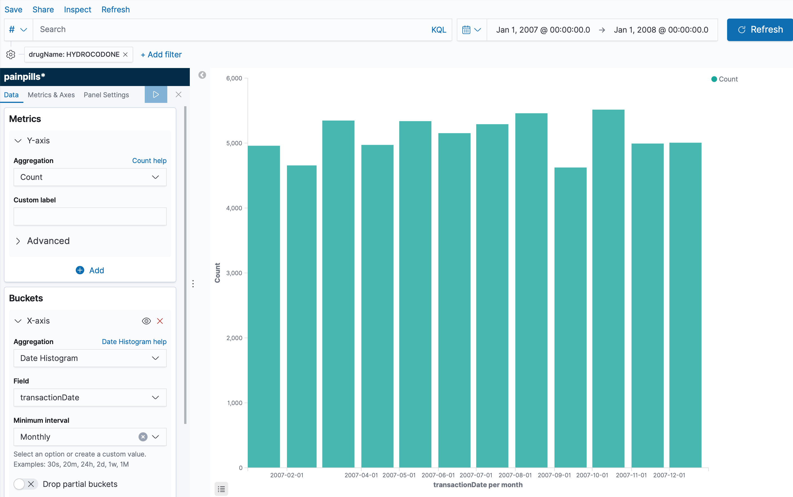
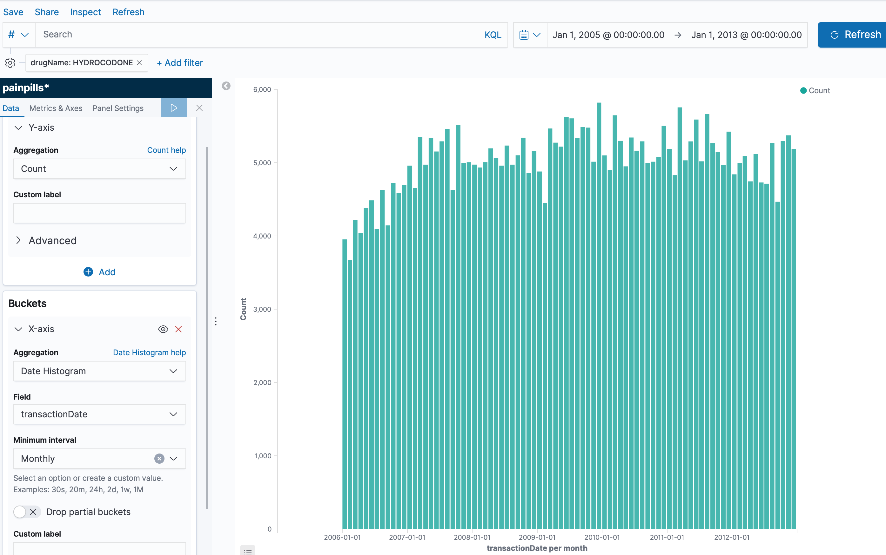
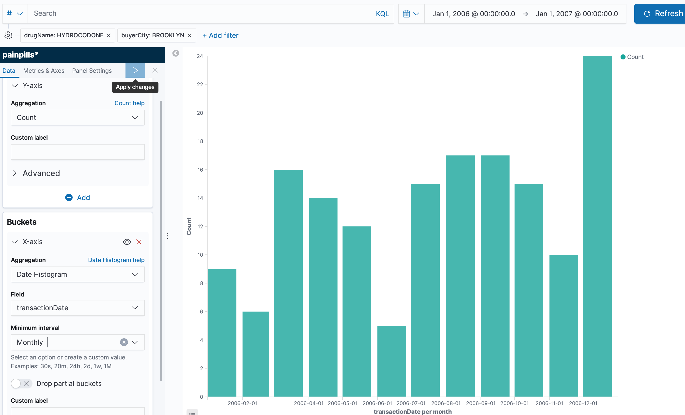

# Elasticsearch-only

[Elasticsearch](https://www.elastic.co/) is a search engine based on Apache Lucene.
It can be used to search all kinds of documents with a near real-time search.
Elasticsearch is particularly good to perform search queries and aggregating data.

The company behind Elastic also created a data visualization called Kibana, that comes in very handy when to perform queries directly to elasticsearch. Both have a HTTP API
that allows a user to query easily.

The idea behind this simple elasticsearch-only solution is to demonstrate the power of elasticsearch+kibana
to perform aggregations and visualise them. One of the strong points is that, 
if the volume of the data is "small enough", then using elasticsearch+kibana is an excellent
backend service for visualisation and analytics. It just requires an index and all the
ingestion and query is handled effortlessly. No need to add partitions, pre-configure aggregations, modify data, etc. This is an excellent approach to explore the data and to decide what aggregations and visualisations to do.

## Hands-on
A simple solution is to ingest every line directly to 
elasticsearch. We can use opensource versions of both elasticsearch and kibana.

To run a dockerized (testing/development) version of elasticsearch, I provide a 
docker-compose file that creates a elasticsearch and kibana service locally.
```bash
$ docker-compose up
```

Once the service is up and running, we need to create the index and mapping. We do 
that by running 
```bash
$ ./push_index.sh
```
The bash script deletes any pre-existant index with the same name, it creates a new one 
and it pushes a new mapping accordingly to the defined schema. An example of the reponse of elasticsearch after running the `push_index.sh` script is the following (one json per step):
```json
{
  "acknowledged" : true
}
{
  "acknowledged" : true,
  "shards_acknowledged" : true,
  "index" : "painpills"
}
{
  "acknowledged" : true
}
```

Now, we can push some data to elasticsearch using the provided app written in Scala using Akka. To see details of the app cf. the README.md on the `code` folder.

```bash
$ cd code
$ sbt compile run
```

## Results
I simulated this solution using a small subset of 656,287 rows of 
[Kaggle Pain Pills Dataset](https://www.kaggle.com/paultimothymooney/pain-pills-in-the-usa/version/2)
(total number of rows: 178,598,026) in a MacBook Pro Dual-Core i7@2.8GHz and 16GB RAM. The 
656k rows are stored by elastic in 217 MB. (For full stats on elastic test environment cf. 
elastic-stats.json).

The following query retrieves the count of HYDROCODONE sold per month during 2006, and it was computed in 99ms.
```json
{
  "aggs": {
    "3": {
      "date_histogram": {
        "field": "transactionDate",
        "calendar_interval": "1M",
        "time_zone": "Europe/Paris",
        "min_doc_count": 1
      }
    }
  },
  "size": 0,
  "_source": {
    "excludes": []
  },
  "stored_fields": [
    "*"
  ],
  "script_fields": {},
  "docvalue_fields": [
    {
      "field": "transactionDate",
      "format": "date_time"
    }
  ],
  "query": {
    "bool": {
      "must": [],
      "filter": [
        {
          "match_all": {}
        },
        {
          "match_phrase": {
            "drugName": {
              "query": "HYDROCODONE"
            }
          }
        },
        {
          "range": {
            "transactionDate": {
              "format": "strict_date_optional_time",
              "gte": "2006-12-31T23:00:00.000Z",
              "lte": "2007-12-31T23:00:00.000Z"
            }
          }
        }
      ],
      "should": [],
      "must_not": []
    }
  }
}
```

The response for the query presented above is: 
```json
{
  "took": 99,
  "timed_out": false,
  "_shards": {
    "total": 1,
    "successful": 1,
    "skipped": 0,
    "failed": 0
  },
  "hits": {
    "total": 61313,
    "max_score": null,
    "hits": []
  },
  "aggregations": {
    "3": {
      "buckets": [
        {
          "key_as_string": "01012007",
          "key": 1167606000000,
          "doc_count": 4959
        },
        {
          "key_as_string": "02012007",
          "key": 1170284400000,
          "doc_count": 4656
        },
        {
          "key_as_string": "03012007",
          "key": 1172703600000,
          "doc_count": 5347
        },
        {
          "key_as_string": "04012007",
          "key": 1175378400000,
          "doc_count": 4972
        },
        {
          "key_as_string": "05012007",
          "key": 1177970400000,
          "doc_count": 5338
        },
        {
          "key_as_string": "06012007",
          "key": 1180648800000,
          "doc_count": 5153
        },
        {
          "key_as_string": "07012007",
          "key": 1183240800000,
          "doc_count": 5291
        },
        {
          "key_as_string": "08012007",
          "key": 1185919200000,
          "doc_count": 5459
        },
        {
          "key_as_string": "09012007",
          "key": 1188597600000,
          "doc_count": 4624
        },
        {
          "key_as_string": "10012007",
          "key": 1191189600000,
          "doc_count": 5515
        },
        {
          "key_as_string": "11012007",
          "key": 1193871600000,
          "doc_count": 4993
        },
        {
          "key_as_string": "12012007",
          "key": 1196463600000,
          "doc_count": 5006
        }
      ]
    }
  },
  "status": 200
}
```

We tested the API by doing three more queries, which are quite similar to the previous json. 
Below are the graphs and response times for the four different queries.

A monthly count of Hydrocodone during 2007.


A daily count of Hydrocodone during 2007.


A monthly count of Hydrocodone between 2006 and 2013.


A monthly count of Hydrocodone in 2006 in Brooklyn.



### Performance Summary

| Query       | Response time |
| ----------- | -----------  |
| Monthly count 2007    | 99ms        |
| Daily count 2007  | 39ms         |
| Monthly count 2017-2013 | 128ms |
| Monthly count 2006 & Brooklyn | 26 ms|


## Limitations
The maximum number of documents you can have in a Lucene index is 2,147,483,519. 
In order to maximise performance, the indices require individual crafting, same as do the  infrastructure, sharding, disks etc.

In a real-life sceneario, kibana is not the best tool to present data visualisation to end users, but more to internally explore the data on elasticsearch. Nevertheless, the responses of elasticsearch's API are easy to plug in a more appropriate frontend.

## Pricing estimation on AWS
Based on aws pricing at the time, in EU-Ireland, a medium-size 3-node cluster
costs around 340 USD per month. (m5.large.elasticsearch, 2vCPU, 8GB RAM, 0.158/hour = 
0.158 x 24 x 30 x 3). We also need to add the disk of each node that costs 0.149 per GB /month. (0.149 x 500 x 3). 

For example 3-node cluster with 500GB of storage is around 563 USD / month.
