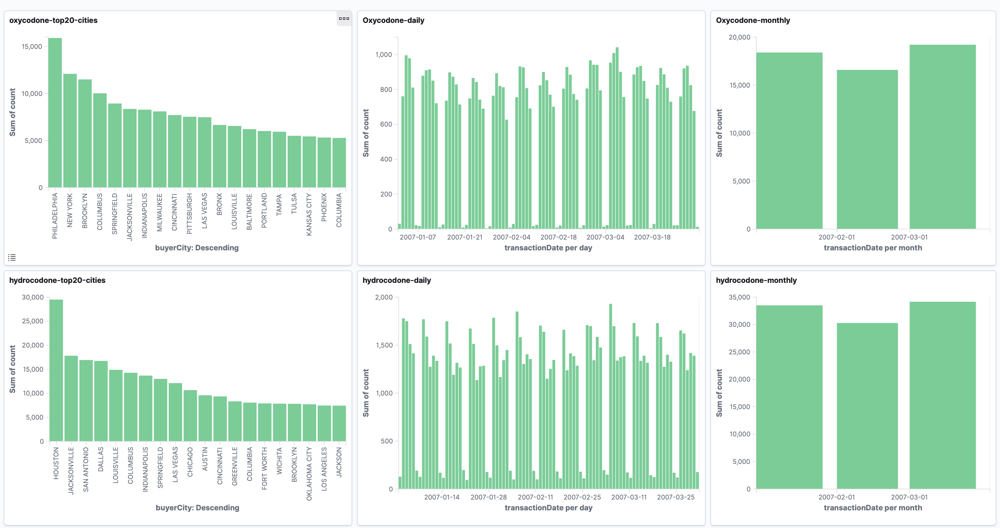

# BigData Solution

## Creating the Datawarehouse (DWH)
A different approach for the [Kaggle Pain Pills Dataset](https://www.kaggle.com/paultimothymooney/pain-pills-in-the-usa/version/2) is to define a data warehouse infrastructure to ingest, process, aggregate and visualise the data.

We will first give some general intuition about each step of the processing, to then decide on the best solution to aggregate data from the Pain Pills dataset.

## Ingestion
For the ingestion, there are different strategies depending on the nature of the data. Some examples 
are:
- Fetch the data from an FTP/SSH server each X minutes.
- Serve an HTTP endpoint to receive HTTP requests with the data.
- Dumping a database every day.
- Pooling records from Kafka (or a similar queue).

For the Pain Pills dataset, we download the file directly from Kaggle's site. The gzipped file is 6GB 
containing 2,147,483,519 records. To make it easier to manipulate, we pre-processed (cf. `0.pre-processing` 
folder) it by splitting the file into multiple files of 5,000,000 records each and uploading them into S3.

_We will assume that each one of these small files is an hour of ingestion and it is already in our infrastructure stored in an S3 bucket. Also, we assume that this data is _raw_, i.e. it is the data extracted from the source without any processing from our side._

The _raw_ data might be in different formats, CSV, excel, JSON, TSV, binary, etc. The ingestion is completed once the data _in original format_ is stored in the infrastructure. In our case, the ingestion part is simulated in the pre-processing step.

## DWH Processing
Once the data has been ingested in the infrastructure, a first job should run to put into in the data warehouse. Due to the nature of the Pain Pills Dataset, the data should be stored in a columnar format like Parquet or ORC. This allows fast search and retrieval from different sources. 

Keeping a clean data warehouse is very important. By choosing a good partitioning, it can make the task of creating new data marts incredibly easy or difficult. This is to be discussed within the team and in collaboration with members of business/analysts/data scientists. A good partitioning can facilitate the data exploration using tools like Athena or Presto and it can help to find where the data has most value while keeping costs low.

### Data Partitioning
The partition of the data is an important subject, and it can imply hidden costs for not partitioning correctly. For example, in a cloud-based infrastructure like AWS, S3 has a price per hit, and an EBS has a price per IO. In both cases, we want to minimise the amount of hits/data access.

In order to preserve (or not) the information of the acquisition time, there are different ways to 
partition the data, depending on the usage. For example, we can consider:

- `/ingestion_year/ingestion_month/ingestion_day/ingestion_hour/drug_name/`: This partition is useful 
if we want to access the data depending on the hour it was ingested to the data warehouse.
- `/ingestion_year/ingestion_month/ingestion_day/ingestion_hour/drug_name/transaction_year/transaction_month/transaction_day`: This partitioning is useful if we want to directly access the transaction day of every ingested hour.
- `/drug_name/transaction_year/transaction_month/transaction_day`: Useful for high-intense access where
the ingestion information is not needed (lost) but transaction information is important.

Due to the nature of Pain Pills Dataset and the queries we would most likely want to do on it in real-life, the best partitioning would be `/drug_name/transaction_year/transaction_month/transaction_day` discarding the information of ingestion. This allows a user to easily query the data using the drug name as a primary filter, and it permits asking for the details of the transactions per day.

### Discussion 

In this particular case, if the sole use case is to compute aggregations based on drug_name and 
transaction date, the partitioning would be `/ingestion_year/ingestion_month/ingestion_day/ingestion_hour/drug_name/`. 
***That partitioning allows the fast computation of aggregations by minimising the hit/access and reading only a few columns, but in real-life
it is impractical because it does not facilitate the access of the data (e.g. it will requires a full scan to get all transactions on a particular transaction day).*** 

## Access to the data
To optimise time and money, the data should be stored in a binary format. This opens the possibility of partitioning, filtering and parallelism it unfortunately closes the door to create an easy API to access it. This is due to the poor support of big data formats for other platforms outside bigdata.

Currently, the way to access the data is using a tool like Presto, AWS Athena, 
Microsoft Data Lake Analytics, Google Big Query or Apache Hive. These tools allow a user to query the data using SQL syntax, which is very convenient, especially for users that don't know how to code a big data job. These tools also allow arranging the data in tables for a full SQL experience. 

Another way to access the data is by creating jobs (like a Spark job) and exporting the data in a user-friendly format, like JSON or CSV.

## Data pipeline
The concept of a data pipeline is used in data environments to describe multiple steps of data transformation. Usually, the first job is to put the data in the correct format. Then one or more jobs can run over the prepared data to produce one or more data marts. Eventually, more jobs could come after the data marts are created to, for example, join the different data marts.

In this case, our pipeline has two steps. One job to store the data in the data warehouse and one job to create the three datamarts.

## Code
In the project PainPills, the `KaggleJob` is a Spark Job that transforms the data from the TSV to ORC
compressed using ZLIB. This is a particularly good strategy because ORC+ZLIB supports predicates pushdown, 
which reduces query/processing time drastically by filtering out data before retrieving it. The details of the implementation are in the README.md in the `code` folder.

The file `AggregateJob` is a Spark Job that computes the aggregation from a already partitioned source. The output of this job is a data mart.

The Jobs are straightforward. The first job is to put the data in the data warehouse, every time that a new batch arrives (e.g. each 1 hour). The idea behind this job is to denormalise the raw data ingested, adding the partitions and storing it in a compressed, binary and handy format like ORC. The second job
computes aggregations to be placed or sent to another service (like elasticsearch).

## Aggregations
We tested the dataset with three aggregations. Each aggregation was computed on both partitions described earlier: one real-life partition and a second partition exclusively optimised for the three cases. As it was said in the discussion part, the optimised (not real-life) partition is way faster than the real-life partition for the aggregations we computed.

**Case 1**: Aggregation drugName & transactionYear & transactionMonth & transactionDay. 
In this scenario, the output is 5103 rows in JSON format.

**Case 2**: Aggregation drugName & transactionYear & transactionMonth 
In this scenario, the output is 168 rows in json format.

**Case 3**: Aggregation drugName & buyerCity
In this scenario, the output is 17915 rows in JSON format.

Each of the outputs is in the folder `output/{day, month, city}`.

## Performance Summary
We simulated different partitioning using a subset of 5,000,000 rows of 
[Kaggle Pain Pills Dataset](https://www.kaggle.com/paultimothymooney/pain-pills-in-the-usa/version/2)
(total number of rows: 178,598,026) in a MacBook Pro Dual-Core i7@2.8GHz and 16GB RAM.

- Partition 1: `/drug_name/transaction_year/transaction_month/transaction_day`
- Partition 2:  `/ingestion_year/ingestion_month/ingestion_day/ingestion_hour/drug_name/`
- No partition: The aggregation is computed directly taking the compressed file with 5,000,000 lines.

Before starting, we mesured the time to create the different partitions.

| Partition   |  creation time        |
| ----------- | -----------  |
| Partition 1 | 8m3s         |
| Partition 2 | 3m18s        |

Case 1: Aggregation drugName & transactionYear & transactionMonth & transactionDay. 

| Aggregation case 1 |  time |
| ----------- | -----------  |
| Partition 1 | 1m18s        |
| Partition 2 | 19s          |
| No partition| 1m3s          |

Case 2: Aggregation drugName & transactionYear & transactionMonth 

| Aggregation case 2 |  time |
| ----------- | -----------  |
| Partition 1 | 1m0s         |
| Partition 2 | 18s          |
| No partition| 58s          |

Case 3: Aggregation drugName & buyerCity

| Aggregation case 3 |  time |
| ----------- | -----------  |
| Partition 1 | 1m45s        |
| Partition 2 | 19s          |
| No partition| 1m8s         |

## Visualisation of the data
For this task, we decided to export the results of every job _(each data mart)_ directly to elasticsearch to visualise the aggregated data using kibana. 
Aggregating the data using Spark is a largely better option than feeding every single row to elasticsearch. In the folder `1.solution-elk` there is an extensive introduction to elasticsearch.

Instead of inserting 5,000,000 of rows, ingesting only the aggregated data is around *300 times smaller* for the biggest data mart (for the case 2, the difference is 30,000 times smaller or just 168 rows to ingest). Separating reponsabilities and using big data tools to carry the heavy low of the aggregations allows a better performance of elasticsearch, lower costs and better user experience.

The following graphs are a sample of possible visualisations. On the top row we present some aggregations on Oxycodone and on the bottom row Hydrocodone. From left to right: Count of top 20 cities, Daily count and monthly count. In the folder kibana it is possible to find the export of the dashboard to easily import it in kibana.

We provided the ouput of the jobs. To replicate this dashboard, first run a elasticsearch and kibana instance (like the docker-compose file in the solution-elk folder) and execute the `output_to_elastic.sh`.
