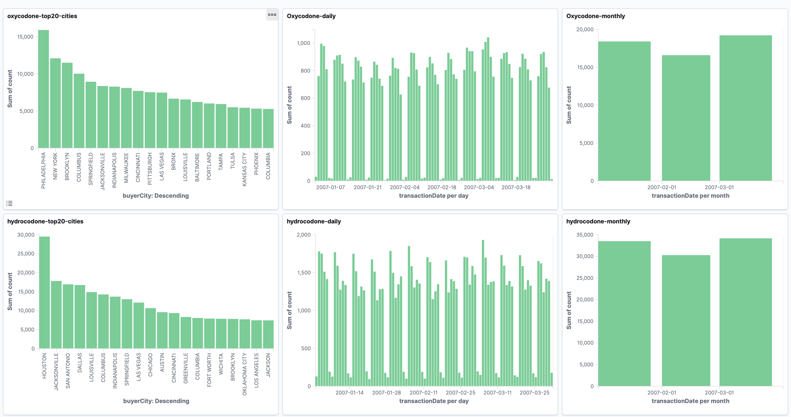

# Big Data Solution

## Creating the Datawarehouse (DWH)
A different approach for the [Kaggle Pain Pills Dataset](https://www.kaggle.com/paultimothymooney/pain-pills-in-the-usa/version/2) is to define a datawarehouse infrastructure to ingest, process, 
aggregation and visualization of the data.

To get started, we will give some general intuition about each step of the processing, then the best 
solution of the Pain Pills dataset.

## Ingestion
For the ingestion, there are different strategies depending on the nature of the data. Some examples 
are:
- Fetch the data from a FTP/SSH server each X minutes.
- Serve a HTTP endpoint to receive HTTP requests with the data.
- Dumping a database everyday.
- Pooling records from Kafka (or similar queue).

For the Pain Pills dataset, we download the file directly from Kaggle's site. The gzipped file is 6GB 
containing 2,147,483,519 records. To make easier to manipulate, we pre-processing (cf. pre-processing 
folder) it by splitting the file in multiple files of 5,000,000 records each and uploading them into S3.

_We will assume that each one of these small files is hour of ingestion and it is already in our 
infrastructure stored in a S3 bucket. Also we assume that this data is _raw_, ie. it is the data 
extracted from the source without any processing from our side._

The _raw_ data might be in different formats, csv, excel, json, tsv, binary, etc. The ingestion is completed once the data _in original format_ is stored in the infrastructure.

## DWH Processing
Once the data has been ingested in the infrastructure, a first job should run to put it in the 
datawarehouse. Due to the nature of the Pain Pills Dataset, the data should stored in a columnar format 
like Parquet or ORC. This allows fast search, and retrieval from different sources. 

Keeping a clean data warehouse is very important. By choosing a good partitioning, it make the task of 
creating new data marts incredible easy or difficult and it can facilitate the exploration using Athena 
or Presto while keeping costs low.

### Data Partitioning
The partition of the data is a important subject and it can imply hidden costs for not partitioning 
correctly. For example, in a cloud-based infrastructure like AWS, S3 has a price per hit and a EBS has 
a price per IO. In both cases, we want to minimize the amount of hit/data access.

In order to preserve (or not) the information of the acquisition time, there are different ways to 
partition the data, depending on the usage of the data, for example we can mention:

- `/ingestion_year/ingestion_month/ingestion_day/ingestion_hour/drug_name/`: This partition is useful 
if we want to access to the data depending on the hour it was ingested to the data warehouse.
- `/ingestion_year/ingestion_month/ingestion_day/ingestion_hour/drug_name/transaction_year/transaction_month/transaction_day`: This partitioning is useful if we want to access directly to the 
transaction day per every ingested hour.
- `/drug_name/transaction_year/transaction_month/transaction_day`: Useful for high-intense access where
the ingestion information is not needed (lost), and transaction information is important.

Due to the nature of Pain Pills Dataset and the queries we want to do on it, the best partitioning is 
to keep `/drug_name/transaction_year/transaction_month/transaction_day` as transaction while descarding 
the information of ingestion. This allows a user to easily query the data using the drug name as 
primary filter, and it allows to ask for the detail of the transactions per day.

### Discusion 
The partitioning is an important topic to discuss within the team and business/analysts/data scienstist 
in order to find where the data has more value while reducing infrastructure costs. 

In this particular case, if the solely use case is to compute aggregation based on drug_name and 
transaction date, a better partitioning would be 
`/ingestion_year/ingestion_month/ingestion_day/ingestion_hour/drug_name/`. ***That partitioning allows 
the computation of aggregations faster by minimizing the hit/access and reading only few columns, but 
it impractical due to it does not give any improvements (it requires a full scan) on a real-life 
sceneario.*** 

## Access to the data
To optimise time and money, the data should be stored in a binary format. This opens the posibility of 
partitioning, filtering and paralelism while it closes the door to create an easy API to access to it. This 
is due to the poor support of big data formats for other platforms outside bigdata.

Currently the way to access the data is using a tool like Presto, AWS Athena, 
Microsoft Data Lake Analytics, Google Big Query and Apache Hive. These tools allows a user to query the data 
using SQL syntax, which could be very convienent, especially if for the users dont know how to code a Spark 
job. These tools also allows arrange the data in tables for a full SQL experience. 

Another way to access the data is creating spark jobs and exporting the data in a user-friendly, like JSON or 
CSV.

## Code
In the project PainPills, the `KaggleJob` is a Spark Job that transforms the data from the TSV to ORC
compressed using ZLIB. This is a particulary good strategy because ORC+ZLIB supports predicates pushdown
which reduces drastically query/processing time by filtering out data before retrieving it. The details 
of the implementation are in the README.md in the spark-painpills folder.

The file `AggXXXJob` is a Spark Job that computes the aggregation from a source already partitioned.

The Jobs are straighforward. The first job is to put the data in the data warehouse, every time that a new
batch arrives (eg. each 1 hour). The idea behind this job is to denormalize the raw data ingested, adding 
the partitions and storing it in a compressed, binary and handy format like ORC. The second job
computes aggregations to be placed or sent to another service (like elasticsearch).

## Aggregation

We tested the dataset with three aggregations and the two partitions described erlier. One real-life 
partition (Partition 1) and a second partition exclusively optimised for the three cases.

**Case 1**: Aggregation drugName & transactionYear & transactionMonth & transactionDay. 
In this scenario, the output is 5103 rows in json format.

**Case 2**: Aggregation drugName & transactionYear & transactionMonth 
In this scenario, the output is 168 rows in json format.

**Case 3**: Aggregation drugName & buyerCity
In this scenario, the output is 17915 rows in json format.

Each of the outputs is in the folder `output/{day, month, city}`.

## Performance Summary
We simulated different partitioning using a subset of 5,000,000 rows of 
[Kaggle Pain Pills Dataset](https://www.kaggle.com/paultimothymooney/pain-pills-in-the-usa/version/2)
(total number of rows: 178,598,026) in a MacBook Pro Dual-Core i7@2.8GHz and 16GB RAM.

- Partition 1: `/drug_name/transaction_year/transaction_month/transaction_day`
- Partition 2:  `/ingestion_year/ingestion_month/ingestion_day/ingestion_hour/drug_name/`
- No partition: The aggregation is computed directly taking the compressed file with 5,000,000 lines.

| Partition   |  time        |
| ----------- | -----------  |
| Partition 1 | 8m3s         |
| Partition 2 | 3m18s        |

Case 1: Aggregation drugName & transactionYear & transactionMonth & transactionDay. 

| Aggregation case 1 |  time |
| ----------- | -----------  |
| Partition 1 | 1m18s        |
| Partition 2 | 19s          |
| No partition| 1m3s          |

Case 2: Aggregation drugName & transactionYear & transactionMonth 

| Aggregation case 2 |  time |
| ----------- | -----------  |
| Partition 1 | 1m0s         |
| Partition 2 | 18s          |
| No partition| 58s          |

Aggregation drugName & buyerCity

| Aggregation case 3 |  time |
| ----------- | -----------  |
| Partition 1 | 1m45s        |
| Partition 2 | 19s          |
| No partition| 1m8s         |

## Visualization of the data
To visualize the data, the outputs of every aggregation was inserted into elasticsearch. 
(In the folder `solution-elk` there is an extensive introduction to Elasticsearch.)

The following graphs are a sample of possible visualizations. On the top row
we present some aggregations on Oxycodone and on the bottom row Hydrocodone.
From left to right: Count of top 20 cities, Daily count and monthly count.
.

To replicate this dashboard, the export of the dashboard is given in the folder 
kibana. 