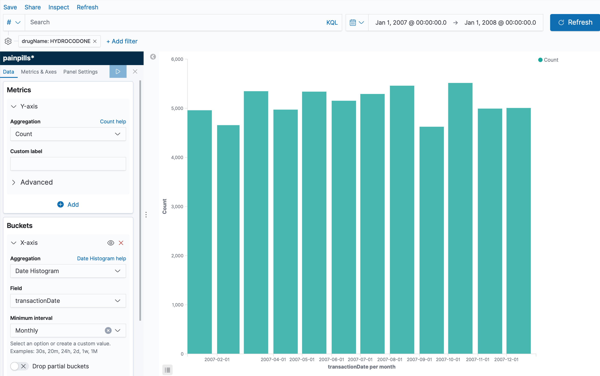
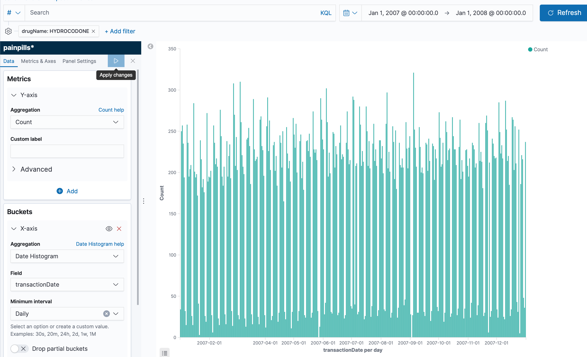
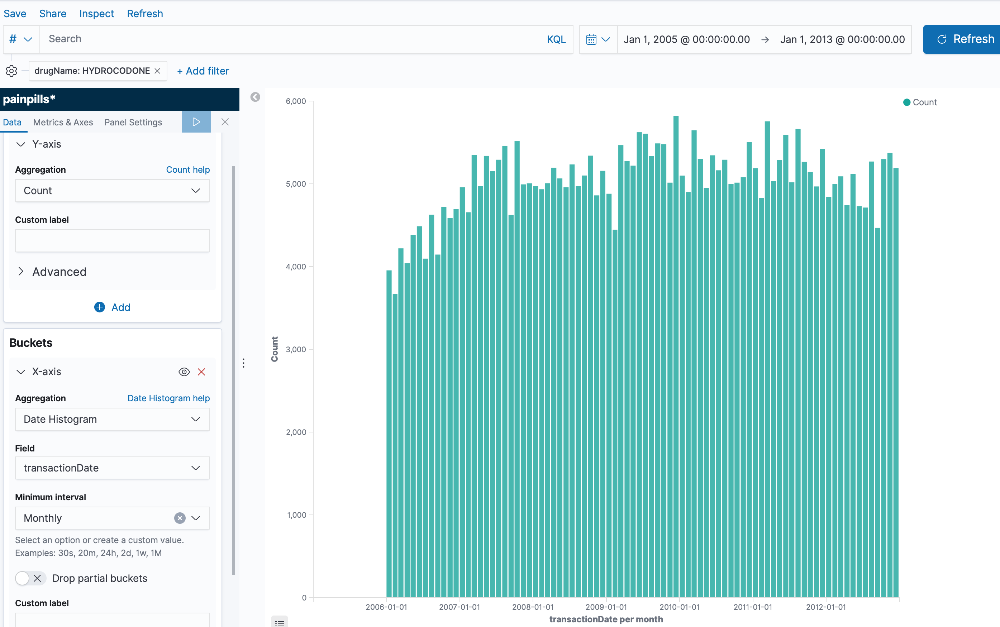
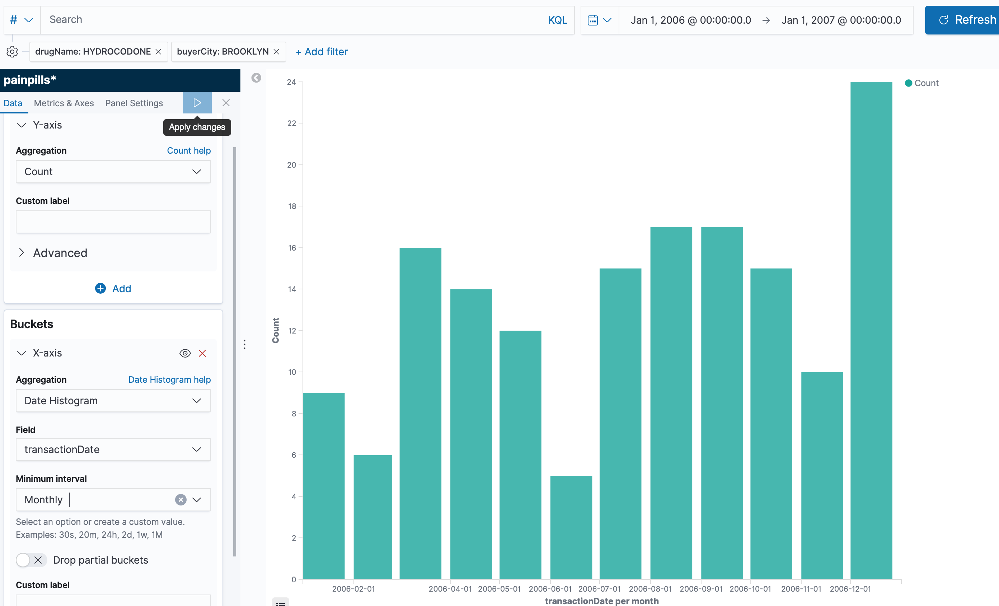

# Elasticsearch-only

[Elasticsearch](https://www.elastic.co/) is a search engine based on Apache Lucene.
It can be used to search all kinds of documents with a near real-time search.
Elasticsearch is particulary good to perform queries on aggregated data. 

The company behind Elastic also created a data visualizator called Kibana that 
comes very handy when to perform queries directly to elasticsearch. 

The idea behind this simple version is to demonstrate the power of elastic+kibana
to perform aggregations and visualise them. One of the strong points is that, 
if the volume of the data is "small enough", then using elastic+kibana is an excellent
backend service for visualisation and analytics. It just requires a index and all the
ingestion and query is hadleded effortless. No need to add partitions, pre-configure 
aggregations, modify data, etc. This is a good approach to explore the data and to decide
what aggreagations and visualisations to do.

## Hands-on
A simple solution to the aggregation problem is to ingest every line directly to 
Elasticsearch. We can use both opensource versions of elasticsearch and kibana.

To run a dockerized (testing/development) version of elasticsearch, I provide a 
docker-compose file.
```bash
$ docker-compose up
```

Once the service is up and running, we need to create the index and mapping. We do 
that by running 
```bash
$ ./push_index.sh
```
The bash script deletes the index in case of existance, it creates a new one 
and finally it pushes a new mapping accordingly to the schema defined.
```json
{
  "acknowledged" : true
}
{
  "acknowledged" : true,
  "shards_acknowledged" : true,
  "index" : "painpills"
}
{
  "acknowledged" : true
}
```

Finally we can push some data to elasticsearch using the app provided.
To see details of the app cf. the README.md on the slk-ingestion folder.
```bash
$ cd slk-ingestion
$ sbt run
```

## Results
I simulated this solution using a small subset of 656,287 rows of 
[Kaggle Pain Pills Dataset](https://www.kaggle.com/paultimothymooney/pain-pills-in-the-usa/version/2)
(total number of rows: 178,598,026) in a MacBook Pro Dual-Core i7@2.8GHz and 16GB RAM. The 
656k rows are stored by elastic in 217 MB. (For full stats on elastic test environment cf. 
elastic-stats.json).

The following query is the count the number of HYDROCODONE sold per month during the 2006,
and it was computed in 99ms.
```json
{
  "aggs": {
    "3": {
      "date_histogram": {
        "field": "transactionDate",
        "calendar_interval": "1M",
        "time_zone": "Europe/Paris",
        "min_doc_count": 1
      }
    }
  },
  "size": 0,
  "_source": {
    "excludes": []
  },
  "stored_fields": [
    "*"
  ],
  "script_fields": {},
  "docvalue_fields": [
    {
      "field": "transactionDate",
      "format": "date_time"
    }
  ],
  "query": {
    "bool": {
      "must": [],
      "filter": [
        {
          "match_all": {}
        },
        {
          "match_phrase": {
            "drugName": {
              "query": "HYDROCODONE"
            }
          }
        },
        {
          "range": {
            "transactionDate": {
              "format": "strict_date_optional_time",
              "gte": "2006-12-31T23:00:00.000Z",
              "lte": "2007-12-31T23:00:00.000Z"
            }
          }
        }
      ],
      "should": [],
      "must_not": []
    }
  }
}
```

The respnse is: 
```json
{
  "took": 99,
  "timed_out": false,
  "_shards": {
    "total": 1,
    "successful": 1,
    "skipped": 0,
    "failed": 0
  },
  "hits": {
    "total": 61313,
    "max_score": null,
    "hits": []
  },
  "aggregations": {
    "3": {
      "buckets": [
        {
          "key_as_string": "01012007",
          "key": 1167606000000,
          "doc_count": 4959
        },
        {
          "key_as_string": "02012007",
          "key": 1170284400000,
          "doc_count": 4656
        },
        {
          "key_as_string": "03012007",
          "key": 1172703600000,
          "doc_count": 5347
        },
        {
          "key_as_string": "04012007",
          "key": 1175378400000,
          "doc_count": 4972
        },
        {
          "key_as_string": "05012007",
          "key": 1177970400000,
          "doc_count": 5338
        },
        {
          "key_as_string": "06012007",
          "key": 1180648800000,
          "doc_count": 5153
        },
        {
          "key_as_string": "07012007",
          "key": 1183240800000,
          "doc_count": 5291
        },
        {
          "key_as_string": "08012007",
          "key": 1185919200000,
          "doc_count": 5459
        },
        {
          "key_as_string": "09012007",
          "key": 1188597600000,
          "doc_count": 4624
        },
        {
          "key_as_string": "10012007",
          "key": 1191189600000,
          "doc_count": 5515
        },
        {
          "key_as_string": "11012007",
          "key": 1193871600000,
          "doc_count": 4993
        },
        {
          "key_as_string": "12012007",
          "key": 1196463600000,
          "doc_count": 5006
        }
      ]
    }
  },
  "status": 200
}
```

The queries are similar, just modifying the parameters. I will skip the json queries and I 
will show the graphs and response times for different queries.

A monthly count of Hydrocodone during the 2007.


A daily count of Hydrocodone during the 2007.


A daily count of Hydrocodone between the 2006 and 2013.


A monthly count of Hydrocodone in 2006 in Brooklyn.



### Performance Summary

| Query       | Response time |
| ----------- | -----------  |
| Monthly count 2007    | 99ms        |
| Daily count 2007  | 39ms         |
| Daily count 2017-2013 | 128ms |
| Monthly count 2006 & Brooklyn | 26 ms|


## Limitations
The maximum number of documents you can have in a Lucene index is 2,147,483,519. 
In order to maxime performance, the indexes require special crafting, same as the 
infrastructure, sharding, disks etc.


## Pricing estimation on AWS
Based on the pricing at the time, in EU-Ireland, a medium-size 3-node cluster
costs around 340 USD per month. (m5.large.elasticsearch, 2vCPU, 8GB RAM, 0.158/hour = 
0.158 x 24 x 30 x 3). On top of that, the disk that costs 0.149 per GB /month. (0.149 x 
500 x 3)

eg. A 3-node cluster with 500GB of storage is around 563 USD / month.
